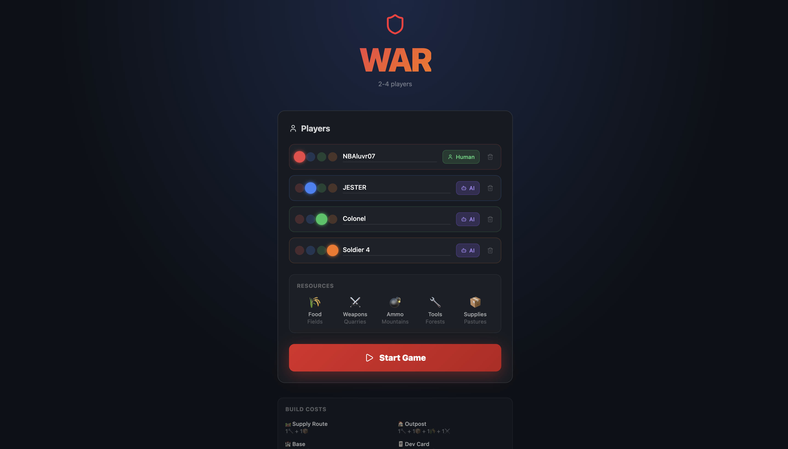

# WAR

A browser-based strategy game based on Catan with a military theme, playable solo against AI opponents or with multiple human players on the same machine.

## Screenshot



## Tech Stack

- React 19 + TypeScript
- Vite
- Tailwind CSS v4
- Zustand v5 (with Immer)
- Framer Motion
- HTML5 Canvas (hex board rendering)

## Running It

```bash
npm install
npm run dev
```

Open `http://localhost:5173` in your browser.

To build for production:

```bash
npm run build
npm run preview
```

## How Multiplayer Works

This is a local hot-seat game. Multiple humans can play on the same machine by setting players to "Human" in the lobby instead of "AI". Each player takes their turn on the same browser window. There is no networked multiplayer.

Up to 4 players are supported (any combination of human and AI).

## Differences from Standard Catan

Resources are renamed with a military theme:
- Wheat -> Food
- Brick -> Weapons
- Ore -> Ammo
- Wood -> Tools
- Sheep -> Supplies

Building names are also renamed (settlements -> outposts, cities -> bases, roads -> supply routes). All rules, costs, and victory conditions are otherwise identical to standard Catan.
